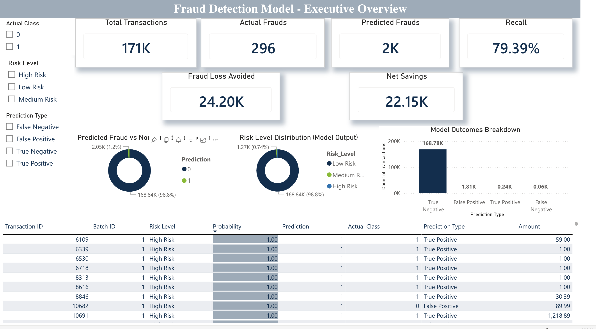

# Fraud Detection Analytics Dashboard

## Overview
This project presents an end-to-end fraud detection analytics system that integrates machine learning, financial impact evaluation, and an executive Power BI dashboard. The solution is designed to reflect real-world fraud operations rather than purely academic modeling.

## Business Context
Fraud detection systems must balance fraud capture with operational cost and customer experience. Models are therefore tuned to optimize net business impact rather than maximizing recall alone.

## Architecture
- Python for data preprocessing, modeling, and threshold optimization  
- SQLite for structured storage of model outputs  
- Power BI for interactive operational reporting  

## Tools & Technologies
- Python (Pandas, NumPy, Scikit-learn, SMOTE)
- Logistic Regression
- SQLite
- Power BI

## Dashboard Preview

## Key Capabilities
- Probability-based fraud risk scoring
- Risk tier classification (High / Medium / Low)
- Recall-focused evaluation with cost trade-offs
- Financial impact metrics (fraud avoided, net savings)
- Transaction-level drill-down for analyst review
